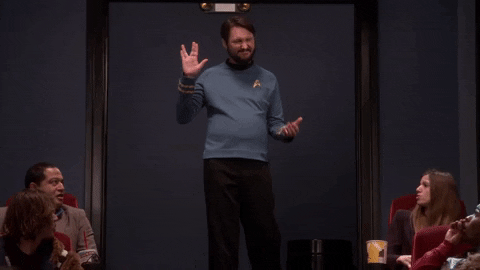

<!-- HEADER / BANNER -->

  

<!-- AVATAR + NOME CURTO -->

&nbsp;&nbsp;&nbsp;**Lázaro Kauã**

 

<!-- SOCIALS -->

  
  
  

<!-- VISITOR COUNTER -->

  

---

## hey there 👋

Apaixonado por tecnologia, cultura maker na veia e códigos na cabeça.  
Transformo processos chatos em automações simples (Python + Selenium) enquanto aprofundo Java no back e React no front.

---

### ⚙️ Tech stack principal

---

### 🚀 Projetos em destaque
| Projeto | Stack | Descrição curta |
|---------|-------|-----------------|
| **Device-Loan** | Google Sheets + Apps Script | Controle de empréstimo de dispositivos |
| **Meu Portfólio** | React + Tailwind | Hub de projetos & estudos |

---

### 🔥 My stats

  
  

<!-- SNAKE ANIMATION -->

  

---

### 🗺️ Roadmap 2025
- [x] Python para automações  
- [x] React básico + Tailwind CSS  
- [x] TADs com JavaScript  
- [ ] Fundamentos Java  
- [ ] API REST com Spring  
- [ ] CI/CD no GitHub Actions  
- [ ] React avançado (hooks custom)  
- [ ] Clean Architecture + TDD  

---

  
Fun facts

  * Team dark-theme forever  
  * Live long and code 🖖  
     
  * Drum pra resetar a mente  
  * Frase preferida: **“Faça do silêncio o seu mais alto esbravejar. - Lázaro Kauã”**

